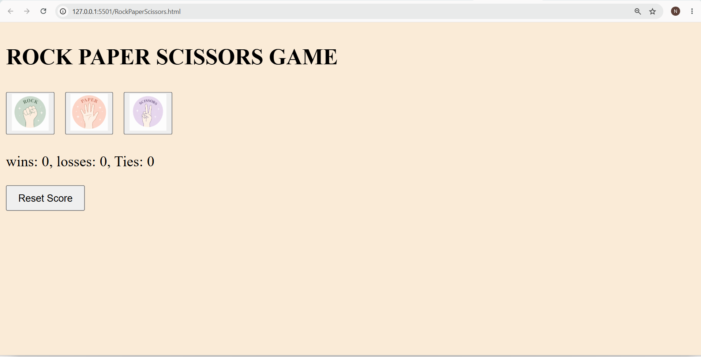
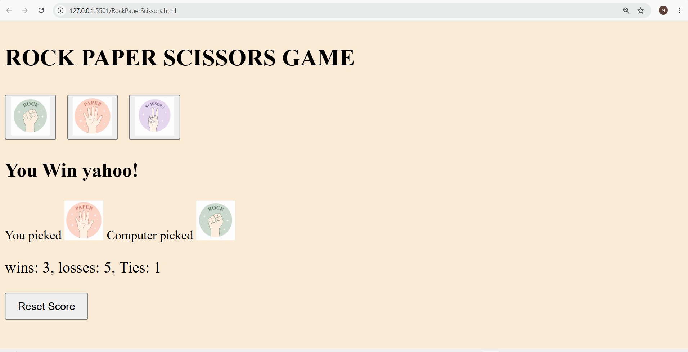

# 🎮 Rock Paper Scissors Game

A simple and interactive **Rock Paper Scissors** game built using **HTML, CSS, and JavaScript**. Play against the computer, view the game results instantly, and keep track of your score using the browser's Local Storage.

---

## 📸 Screenshots

### Home Page



### Gameplay



> 


---

## ✨ Features

- 🎲 Play Rock, Paper, or Scissors against the computer
- 🤖 Random computer move generation
- 🏆 Displays game result (Win, Lose, or Tie)
- 📊 Keeps track of Wins, Losses, and Ties
- 💾 Score is saved using Local Storage
- 🔄 Reset Score button
- 🎨 Clean and beginner-friendly user interface

---

## 🛠️ Technologies Used

- HTML5
- CSS3
- JavaScript (ES6)
- DOM Manipulation
- Local Storage

---

## 📂 Project Structure

```
Rock-Paper-Scissors/
│── index.html
│── RockPaperScissors.css
│── RockPaperScissors.js
│── images/
│   ├── Rock-emoji.png
│   ├── Paper-emoji.png
│   └── Scissors-emoji.png
│── README.md
```

---

## 🚀 How to Run

1. Clone this repository

```bash
git clone https://github.com/nikithamadadi/rock-paper-scissors.git
```

2. Open the project folder.

3. Open **index.html** in your browser.

No additional setup or installation is required.

---

## 🎮 How to Play

1. Click on **Rock**, **Paper**, or **Scissors**.
2. The computer randomly selects its move.
3. The game displays:
   - Your move
   - Computer's move
   - Result (Win, Lose, or Tie)
4. Your score is automatically updated and saved.
5. Click **Reset Score** to clear the scoreboard.

---

## 💡 Concepts Practiced

- Functions
- Conditional Statements
- Random Number Generation
- DOM Manipulation
- Event Handling
- Template Literals
- Local Storage
- JavaScript Object

---

## 👩‍💻 Author

**Nikitha Madadi**

GitHub: https://github.com/nikithamadadi

---

⭐ If you like this project, consider giving it a star!
